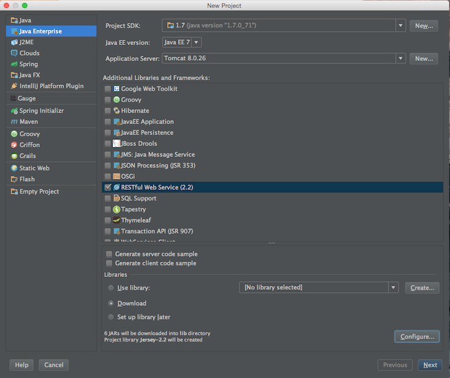
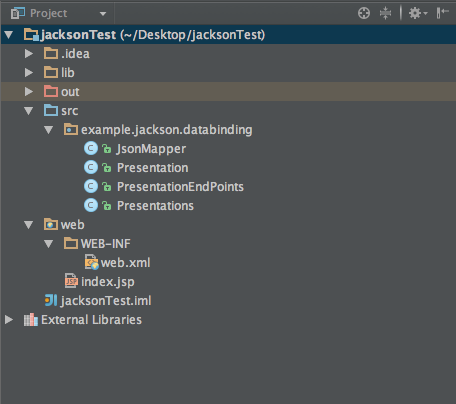
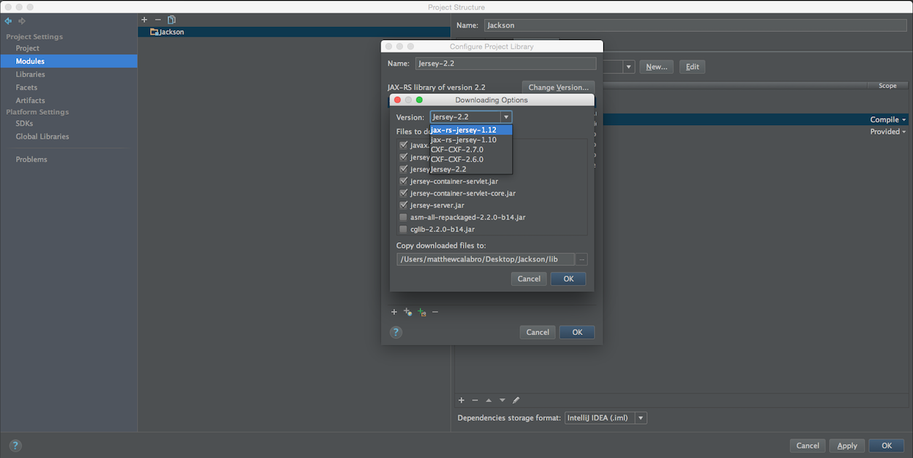
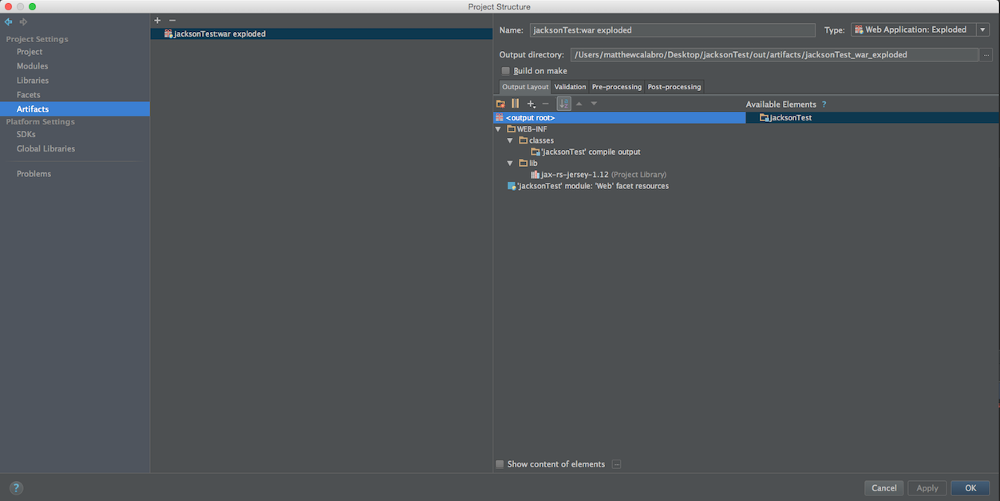

##Project Setup

###Step 1:

1. Create a new Project in IntelliJ

2. Select the checkboxs for Web Application and RESTful Web Services




###Step 2:

1. Download the "java-jackson-databinding-example" Project files a zip

2. Extract the project files to a directory outside of your project

3. Replace your project web.xml with the one provided in the unzipped files.

4. Copy the "example" folder from the unzipped files to the src folder of your new project. 



####Step 3:

1. Open the Project Structure

2. Update the version of Jersey from 2.2 to 1.12



3. Navigate to the Project Artifacts

4. An Artifact of type "WebApplication: Exploded" should already exist. If not, create one.

5. Under "Available Elements", double-click on all items listed. Jersey-1.12 should be the only missing element.

6. The Artifacts should look like this:



####Step 4:

1. Run the project

2. Make some requests


####Add a Presentation:

```
POST: http://localhost:8080/rest/presentation/add
```

```
BODY: {"date": "11/01/2015", "time" : "06:00PM", "presenterName" : "Matt", "presentationTopic" : "Jackson Data Binding"}
```

####Get a list of Presentations:

```
GET: http://localhost:8080/rest/presentation/presentations
```


